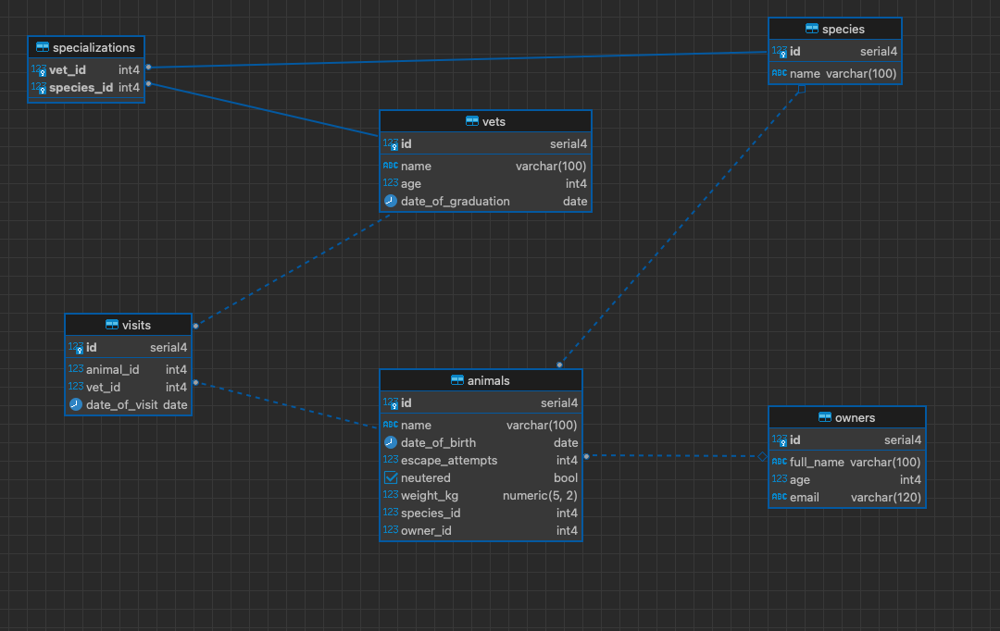

<a name="readme-top"></a>

<!--
HOW TO USE:
This is an example of how you may give instructions on setting up your project locally.

Modify this file to match your project and remove sections that don't apply.

REQUIRED SECTIONS:
- Table of Contents
- About the Project
  - Built With
  - Live Demo
- Getting Started
- Authors
- Future Features
- Contributing
- Show your support
- Acknowledgements
- License

After you're finished please remove all the comments and instructions!
-->


<!-- TABLE OF CONTENTS -->

# 📗 Table of Contents

- [📗 Table of Contents](#-table-of-contents)
- [📖 DB\_Vet\_Clinic ](#-db_vet_clinic-)
  - [🛠 Built With ](#-built-with-)
    - [Tech Stack ](#tech-stack-)
    - [Key Features ](#key-features-)
  - [🚀 Live Demo ](#-live-demo-)
  - [💻 Getting Started ](#-getting-started-)
  - [Setup](#setup)
  - [Database Structure](#database-structure)
  - [🛠 Usage ](#-usage-)
  - [👥 Authors ](#-authors-)
  - [🔭 Future Features ](#-future-features-)
  - [🤝 Contributing ](#-contributing-)
  - [⭐️ Show your support ](#️-show-your-support-)
  - [🙏 Acknowledgments ](#-acknowledgments-)
  - [❓ FAQ ](#-faq-)
  - [📝 License ](#-license-)

<!-- PROJECT DESCRIPTION -->

# 📖 DB_Vet_Clinic <a name="about-project"></a>


In this project, the objective is to develop a comprehensive database for a veterinary clinic aimed at effectively managing crucial information about animals. The tasks encompass designing and implementing tables using SQL, seamlessly incorporating data entries, and executing diverse queries for information retrieval. The ultimate aim is to forge a meticulously organized database, thereby fostering practical proficiency in handling data within the framework of a relational database system.



## 🛠 Built With <a name="built-with"></a>

The project is built using SQL for database management. Getting Started Follow these steps to understand and work on the project:


### Tech Stack <a name="tech-stack"></a>

The project is built using the following technologies:

<details>
  <summary>Server</summary>
  <ul>
    <li><a href="https://expressjs.com/">Express.js</a></li>
  </ul>
</details>

<details>
<summary>Database</summary>
  <ul>
    <li><a href="https://www.postgresql.org/">PostgreSQL</a></li>
  </ul>
</details>

<!-- Features -->

### Key Features <a name="key-features"></a>


- **SQL Database Management**
- **Data Manipulation**
- **Querying Data**

<p align="right">(<a href="#readme-top">back to top</a>)</p>

<!-- LIVE DEMO -->

## 🚀 Live Demo <a name="live-demo"></a>

Unfortunately, there is no live demo available for this project at the moment.

<p align="right">(<a href="#readme-top">back to top</a>)</p>

<!-- GETTING STARTED -->

## 💻 Getting Started <a name="getting-started"></a>

## Setup

To get a local copy up and running, follow these steps.

1. Clone this repository to your local machine:

```
git clone https://github.com/ClaudiaRojasSoto/DB_Vet_Clinic.git

```

2. Set up a PostgreSQL database named vet_clinic.


## Database Structure
The `schema.sql` file includes SQL commands to create the animals table with the following columns:

- `id`: A unique identifier for each animal.
- `name`: The name of the animal.
- `date_of_birth`: The birthdate of the animal.
- `escape_attempts`: The number of escape attempts made by the animal.
- `neutered`: A boolean indicating if the animal is neutered.
- `weight_kg`: The weight of the animal in kilograms.
- `species`: The species of the animal.

You can execute the `schema.sql` file to create the table structure by running:

```
psql -d vet_clinic -a -f schema.sql
```

Make sure you have PostgreSQL installed and configured on your machine before running the command.

Feel free to modify the column descriptions and structure according to your project's needs.

Please note that the database schema and structure provided are based on your project's requirements and can be adjusted as necessary.

## 🛠 Usage <a name="usage"></a>

The `data.sql` file contains SQL commands to insert sample data into the animals table. You can use these commands to populate the table with information about different animals.

The queries.sql file contains SQL queries to answer various questions about the data stored in the animals table. These queries cover topics like filtering animals based on conditions, retrieving specific information, and calculating aggregate values.

After running the queries, you can take screenshots of the results to showcase your work.

## 👥 Authors <a name="authors"></a>

👤 **Claudia Rojas**

-   GitHub: [@githubhandle](https://github.com/ClaudiaRojasSoto)
-   LinkedIn: [LinkedIn](https://www.linkedin.com/in/claudia-rojas-soto/)

<p align="right">(<a href="#readme-top">back to top</a>)</p>

<!-- FUTURE FEATURES -->

## 🔭 Future Features <a name="future-features"></a>

- [ ] **User Authentication**
- [ ] **Appointment Scheduling**
- [ ] **Medical Profile of the Pet**

<p align="right">(<a href="#readme-top">back to top</a>)</p>

<!-- CONTRIBUTING -->

## 🤝 Contributing <a name="contributing"></a>

Contributions, issues, and feature requests are welcome!

Feel free to check the [issues page](https://github.com/ClaudiaRojasSoto/DB_Vet_Clinic/issues).

<p align="right">(<a href="#readme-top">back to top</a>)</p>

<!-- SUPPORT -->

## ⭐️ Show your support <a name="support"></a>


If you like this project or if it helped you, please give a ⭐️. I'd really appreciate it!

<p align="right">(<a href="#readme-top">back to top</a>)</p>

<!-- ACKNOWLEDGEMENTS -->

## 🙏 Acknowledgments <a name="acknowledgements"></a>

I would like to thank Microverse and all my peers and colleagues at Microverse for giving me the opportunity to work on this project.

<p align="right">(<a href="#readme-top">back to top</a>)</p>

<!-- FAQ (optional) -->

## ❓ FAQ <a name="faq"></a>

**How do I set up the PostgreSQL database for this project?**

Clone the repository to your local machine
Create a new PostgreSQL database named "vet_clinic".
Execute the SQL commands in the "schema.sql" file to create the necessary table structure.
Populate the database with sample data by executing the SQL commands in the "data.sql" file.

**How can I run the queries provided in the "queries.sql" file?**

To run the queries provided in the "queries.sql" file, you can use a PostgreSQL client or interface, such as psql command-line tool or a graphical tool like pgAdmin. Connect to your "vet_clinic" database and execute the queries in the file to retrieve the desired information from the database.


<p align="right">(<a href="#readme-top">back to top</a>)</p>

<!-- LICENSE -->

## 📝 License <a name="license"></a>

This project is [MIT](MIT.md).


<p align="right">(<a href="#readme-top">back to top</a>)</p>
